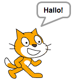

## Figur sprechen lassen



Dieser Block zeigt eine Sprechblase für 2 Sekunden lang an erst danach wird der Block darunter gestartet

```blocks
    sage [Hallo!] für (2) Sek.
```

Dieser Block zeigt eine Sprechblase und macht keine Pause  

```blocks
    sage [Hallo!]
```

Du musst die Sprechblase mit einem zweiten leeren Block wieder ausblenden

```blocks
    sage []
```

<div class="checklist-symbol">Checkliste</div>

- Probiere einmal beide Blöcke aus
- Schau einmal was der Unterschied zu den <span class="visual-block">denke</span>-Blöcken ist     


<div class="test-symbol">Teste dein Projekt</div>

## Mit Figur reden

Eine Figur kann auch Fragen stellen

<div class="checklist-symbol">Checklist</div>

- Wähle eine Figur aus

- Füge folgenden Block hinzu

```blocks
    Wenn die grüne Flagge angeklickt
    frage [Soll ich die Schatztruhe öffnen?] und warte
```

<div class="test-symbol">Teste dein Projekt</div>

Es wird jetzt ein Eingabefeld angezeigt. Der Computer merkt sich dann was du eingibst. 


Um auf die Antwort zu reagieren verwende wir im nächsten Schritt den <span class="sensor-value">Antwort</span>-Block 

- Füge unter dem <span class="sensor-block">frage</span>-Block diese Blöcke ein 

```blocks
    falls <(Antwort) = [ja]> dann
        sage [Toll, ganz viel Gold] für (2) Sek.
    sonst
        sage [Dann eben nicht] für (2) Sek. 
    Ende
```

<div class="test-symbol">Teste dein Projekt</div>

-  Du kannst auch zwischen mehreren Antworten unterscheiden. Füge dazu unter sonst noch einen <span class="control-block">falls</span>-Block ein  


```blocks
    falls <(Antwort) = [ja]> dann
        sage [Toll, ganz viel Gold] für (2) Sek.
    sonst
        falls <(Antwort) = [nein]> dann
            sage [Dann eben nicht] für (2) Sek.
        sonst
            sage [Ich weiß nicht was du meinst] für (2) Sek.
    Ende
```

<div class="test-symbol">Teste dein Projekt</div>
